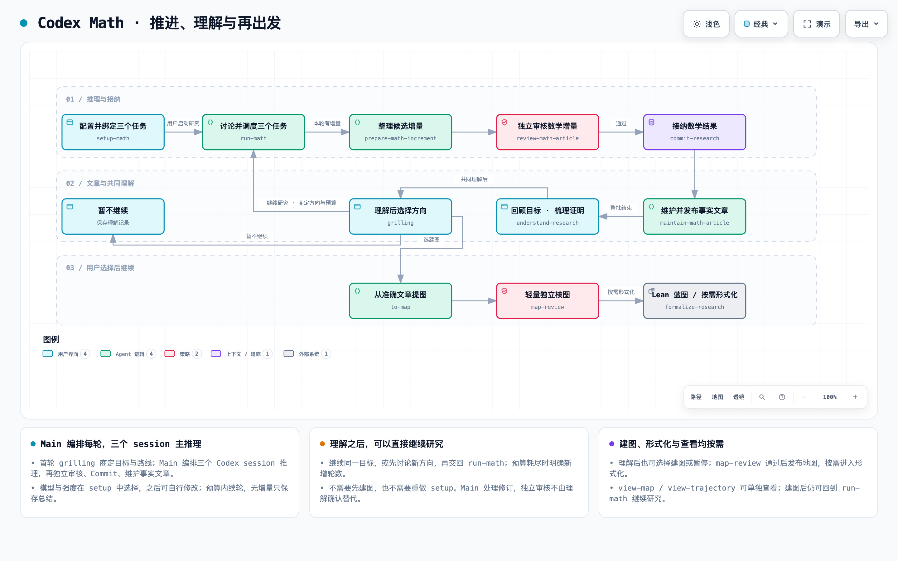

# Codex Math

**好用的数学智能体，让你与 AI 一起提出问题、推进证明、理解结果。**

你可以从一个证明目标或研究兴趣出发，与智能体商定方向、推进研究，在关键决定上参与讨论，并根据证据理解结果、选择下一步。

首次使用请先阅读 [中文使用说明](使用说明.md)。

## 设计理念

我们把 harness 看作人机协作的接口。随着模型能力增强，它的重心应从规定模型行为，转向帮助人与模型更好地合作：让用户表达意图、参与关键决定、看清证据与不确定性，并随时接手或调整方向。

模型应有更大的空间选择推理方法。目标澄清、独立审核、共同理解和研究记录，让双方能够围绕可检查的结果持续协作；预先写死思考步骤的规定，则应随模型能力提升逐步减少。每个交互和流程，都应以是否帮助这种协作为设计标准。

Codex Math 以技能套装交付，用三个持久 Codex 任务承担主要推理。

**setup-math 自动创建并绑定 → run-math 与用户商定目标及首轮路线 → 有界推理 → 独立审核与数学 Commit → 发布事实文章 → 共同理解 → 按需地图与 Lean 形式化。**

## 工作流程图

下面展示按轮自动接纳模式；手动模式在数学 Commit 前由用户选择接纳范围。首次 setup 完成后停止，由用户调用 run-math 开始研究。

<a href="diagram/codex-math-workflow.png">
  <picture>
    <source media="(prefers-color-scheme: dark)" srcset="diagram/codex-math-workflow-dark.png">
    
  </picture>
</a>

[下载交互版 HTML](https://github.com/cyw6130/codex-math/raw/refs/heads/main/diagram/codex-math-workflow.html) · [可编辑图源](diagram/codex-math-workflow.json)

交互版下载后用浏览器打开，可缩放、切换主题和查看节点。

- **已有共识直接复用**：继续同一目标不重复 grilling 或 setup；首轮之后，预算内可调整方法与分工。
- **审核与收尾不另计研究轮**：预算耗尽仍完成已派发回收和本地收尾；需要持续新推理的修复任务按新轮计数。超时或失败如实归档，不把部分返回当作完整一轮接纳。
- **地图不是续轮门槛**：选择蓝图或形式化时先复用或补齐相关地图；只选择建图不会自动开始形式化。Dictionary、Issue 和查看入口均可按需单独使用。

## 使用

需要支持跨任务创建、读取、发送、等待及 heartbeat 的 Codex 桌面宿主，以及 Python 3.10+、Node.js；研究项目须在宿主中已保存。模型由目标宿主支持情况决定，首次 setup 直接询问模型和推理强度，创建后可在各任务中自行修改。Main 不再自动对齐。

1. 克隆本仓库，或下载并解压完整源码到目标机器固定位置，保留 skills/、runtime/、tools/、vendor/ 同级布局。
2. 可先让 Codex 直接读取 [setup-math](skills/setup-math/SKILL.md)；若安装到宿主技能目录，按宿主机制为 skills/ 下各技能建立指向真实目录的链接，不只复制 SKILL.md。shared/ 是公共资源，不是技能入口。安装时确认同名技能指向本套装目录。外部 theorem、connect-concepts 与 map-view 按调用需求提供；grilling 已随包分发。地图阅读器和 Lean 工程按需配置。
3. 在目标项目调用 `$setup-math`，选择模型/强度、分工和预算。setup 自动在同一项目目录创建并绑定三个平级 Codex 任务，记录项目真实接纳授权，再询问是否使用本地材料。
4. 调用 `$run-math <证明目标或研究兴趣>`。首次实际 grilling 后才研究；后续按已确认目标和预算推进。

三个任务可以读取授权材料并在各自指定目录保存实验；共同事实文章、调度状态和数学接纳由 Main 维护。原生独立审核者不由三个证明任务替代。Main 活跃时有界等待及时接续，heartbeat 用于中断恢复。无新增数学内容的一轮也保留真实记录。

[设计决定](docs/design.md) · [项目配置](skills/run-math/references/project-state.md) · [轮次合同](skills/shared/ROUND-WORKFLOW.md) · [文章接口](skills/shared/ARTICLE-WORKFLOW.md)

## 验证

在套装目录运行 `python3 tools/check_suite.py`、`npm test`、`python3 -m unittest discover -s tests -p 'test_*.py'`。这些验证本地结构、数学运行时和恢复规则；不等于真实宿主创建/绑定/派发已验证，也不构成数学审核。验收记录见 [verification/report.md](verification/report.md)。

## 许可证与来源

原创内容采用 [MIT](LICENSE)，第三方许可与署名见 [来源说明](THIRD_PARTY_NOTICES.md)。

## 获取代码

```sh
git clone https://github.com/cyw6130/codex-math.git
```

本项目是社区维护的工作流，不是 OpenAI 官方产品。先读使用说明，再在目标宿主完成首次配置；不自动安装或运行研究。

## 了解系统与参与改进

- **[dictionary](skills/dictionary/SKILL.md)：理解 Codex Math 的概念与设计。** 查询概念的含义、彼此的关系、设计依据及当前实现情况。例如：`$dictionary 研究轮次是什么？它与审核有什么关系？`
- **[issue](.agents/skills/issue/SKILL.md)：把反馈与想法整理成可讨论的改进事项。** 帮你梳理使用问题、功能建议或已完成的改动，整理成 GitHub Issue，供协作者讨论和跟进。例如：`$issue 我希望能更方便地查看每轮研究进展`。发布前会先展示草稿，由你确认。

dictionary 随技能套装提供；issue 供在本仓库内参与维护的用户使用，克隆仓库后即可读取对应技能。
